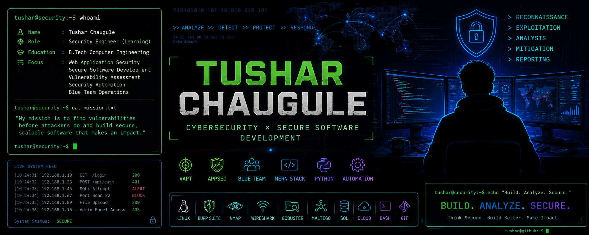

<p align="center">
  
</p>
<p align="center">

<a href="mailto:chauguletushar2021@gmail.com">

</a>

<a href="https://www.linkedin.com/in/tushar-chaugule-62b0652b1">

</a>

<a href="https://github.com/Tushar8767">

</a>

</p>
---

## $ whoami

```yaml
Name: Tushar Chaugule
Role: Computer Engineering Undergraduate
Focus:
  - Cybersecurity
  - Secure Software Development
  - Web Application Security
  - MERN Stack
```

I'm passionate about combining cybersecurity with software engineering. My work includes vulnerability assessment, web application security, secure backend development, and full-stack applications.

---

## $ ls skills/

### Cybersecurity
- Burp Suite
- Nmap
- Gobuster
- Wireshark
- Maltego
- Linux
- OWASP Top 10
- SQL Injection
- API Security
- OSINT

### Programming
- Python
- C++
- JavaScript
- SQL
- Bash

### Development
- React.js
- Node.js
- Express.js
- MongoDB
- MySQL
- REST APIs
- JWT
- Git & GitHub

---

# 🚀 Featured Projects

---

## 🔒 Web Application Vulnerability Assessment

**PortSwigger Web Security Academy • SQL Injection • OWASP Top 10**

Performed a manual vulnerability assessment of an intentionally vulnerable web application within the PortSwigger Web Security Academy laboratory environment.

### Key Highlights

- Validated an SQL Injection authentication bypass vulnerability through manual testing.
- Analyzed vulnerability severity using CVSS v3.1, CWE-89, and OWASP Top 10.
- Evaluated technical and business impact using the CIA security model.
- Prepared a professional vulnerability assessment report with proof-of-concept and remediation recommendations.

<p align="left">

<a href="https://github.com/Tushar8767/WEB-APP-SECURITY---Vulnerability-Assessment-Reporting">

</a>

</p>

---

## 🛡️ KS Sentinel

**Modular MERN Platform • React.js • Node.js • Express.js • MongoDB • Vite**

KS Sentinel is a modular full-stack web application featuring a desktop-style interface, reusable UI components, and scalable backend architecture.

### Key Highlights

- Desktop-style modular workspace
- React.js + Vite frontend
- RESTful APIs with Express.js
- MongoDB-backed persistent storage
- Scalable MERN architecture
- Modular project structure

<p align="left">

<a href="https://ks-sentinel-os.onrender.com/">

</a>

&nbsp;

<a href="https://github.com/Tushar8767/KS_Sentinel">

</a>

</p>

---

## 🌐 Enterprise Data Center Web Application Assessment

**Burp Suite • Gobuster • API Security • Browser Developer Tools**

Performed a security assessment of an enterprise web application within a controlled Cyber Range environment.

### Key Highlights

- Identified exposed configuration files and sensitive application resources.
- Performed directory enumeration using Gobuster.
- Inspected application source code and hidden endpoints.
- Analyzed authenticated API requests using Burp Suite.
- Documented findings, risk assessment, proof-of-concept, and remediation recommendations in a professional technical report.

<p align="left">

<a href="https://github.com/Tushar8767/YOUR_REPOSITORY_NAME">

</a>

</p>

---

## 🤖 AI Workspace

**React.js • Node.js • Express.js • MongoDB**

A full-stack AI-powered workspace integrating authentication, AI-assisted features, and RESTful backend services.

### Key Highlights

- AI chatbot interface
- Text summarization
- JWT authentication
- Protected routes
- RESTful APIs
- MongoDB-backed user management
- Modular full-stack architecture

<p align="left">

<a href="https://github.com/Tushar8767/AI_Assistant">

</a>

</p>

---

## 📜 Certifications

- Ethical Hacking — NPTEL (IIT Kharagpur)
- Network Security — NPTEL (IIT Kharagpur)
- AWS Hands-on Workshop
- CEH Practical Training (Cyber Range)

---

## 📚 Currently Learning

- Security Monitoring & Incident Response
- Detection Engineering
- Python Automation
- Cloud Security
- DevSecOps

---

## 📈 GitHub Stats

<p align="center">


</p>

<p align="center">

</p>

<p align="center">

</p>

---

## 📫 Connect

- **Email:** <mailto:chauguletushar2021@gmail.com>
- **LinkedIn:** https://www.linkedin.com/in/tushar-chaugule-62b0652b1
- **GitHub:** https://github.com/Tushar8767

```bash
tushar@github:~$ echo "Think Secure. Build Better."
```
